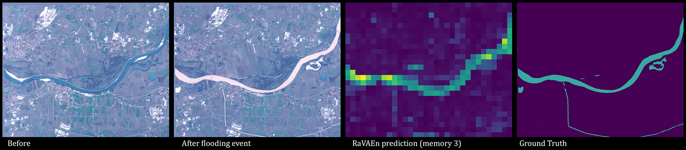
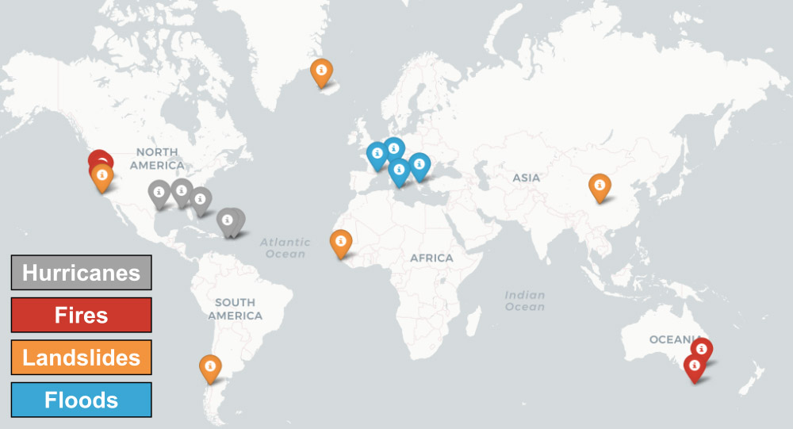
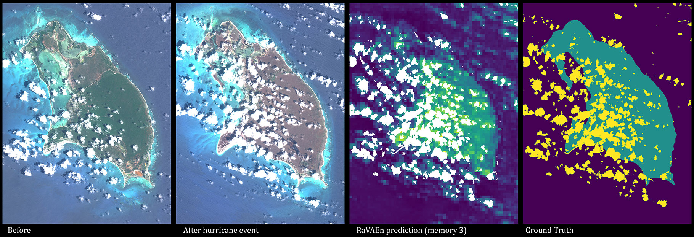

# RaVAEn

<table><tr>
  <td width="250px"></td>  
  <td>
    <b>The RaVÆn system</b><br>
    <em>We introduce the RaVÆn system, a lightweight, unsupervised approach for change detection in satellite data based on Variational Auto-Encoders (VAEs) with the specific purpose of on-board deployment. It flags changed areas to prioritise for downlink, shortening the response time. We show that the proposed method outperforms pixel-wise baselines and we test it on resource-limited hardware. We also release the annotated dataset of extreme events. Work conducted at the <a href="https://fdleurope.org/fdl-europe-2021">FDL Europe 2021</a>.
    </em>
</td>  
</tr></table>

<p align="center">
    
</p>

<p align="center">
  <a href="https://arxiv.org/abs/2111.02995">NeurIPS workshop paper</a> •
  <a href="https://www.youtube.com/watch?v=ALtYfcuLzxI">video from AI+HADR'21</a> •
  <a href="notebooks/inference_demo.ipynb">Quick Colab Example </a>
</p>


---

## Unsupervised Change Detection of Extreme Events Using ML On-Board

<p align="center">
    
</p>


> **Abstract:** In this paper, we introduce RaVAEn, a lightweight, unsupervised approach for change detection in satellite data based on Variational Auto-Encoders (VAEs) with the specific purpose of on-board deployment. Applications such as disaster management enormously benefit from the rapid availability of satellite observations. Traditionally, data analysis is performed on the ground after all data is transferred - downlinked - to a ground station. Constraint on the downlink capabilities therefore affects any downstream application. In contrast, RaVAEn pre-processes the sampled data directly on the satellite and flags changed areas to prioritise for downlink, shortening the response time. We verified the efficacy of our system on a dataset composed of time series of catastrophic events - which we plan to release alongside this publication - demonstrating that RaVAEn outperforms pixel-wise baselines. Finally we tested our approach on resource-limited hardware for assessing computational and memory limitations.

### Dataset

The full annotated dataset used for evaluation is hosted on Google Drive <a href="https://drive.google.com/drive/folders/1VEf49IDYFXGKcfvMsfh33VSiyx5MpHEn?usp=sharing">here</a>. It contains 5 locations for each of the Landslide, Hurricane, Fire events and 4 locations for Floods events. For more details see the paper (we use the Sentinel-2 mission, level L1C data).

<p align="center">
    
</p>

For dataset inspection use the prepared <a href="notebooks/data_exploration_demo.ipynb">Colab Dataset Exploration demo </a>.

### Code examples

**Install**

```bash
# This will create a ravaen_env conda environment:
make requirements
conda activate ravaen_env
# Add these to open the prepared notebooks:
conda install nb_conda
jupyter notebook
# This will open an interactive notebook in your browser where you can navigate to the training or inference demo
```

**Inference**

To start using our model for inference, it's best to start with the prepared <a href="notebooks/inference_demo.ipynb"> Colab Inference demo </a>, which downloads our annotated dataset and evaluates a pre-trained model on a selected event type.

```bash
# Check possible parameters with:
!python3 -m scripts.evaluate_model --help 

# Example evaluation script used for the paper results for "small size" VAE model (remeber to adjust paths to the dataset and to the saved model checkpoints)
./bash/eval_run_papers_v3_VAE_128_D_small.sh
```

**Training**

For a fast demo on how to train these models on a custom folder of locations, check the <a href="notebooks/training_demo.ipynb"> Colab Training demo </a> as that presents an easy entry point to this repository.
To reproduce the same training process as reported in the paper, you will need to download the whole WorldFloods dataset (see <a href="https://github.com/spaceml-org/ml4floods">here</a>) and prepare the same folder structure as we chose for the validation datasets.

```bash
# Check possible parameters with:
!python3 -m scripts.train_model --help

# Run the same training script used for the paper results for "small size" VAE model (remember to adjust the paths to the training datasets)
./bash/train_run_papers_v3_VAE_128_small_D.sh
```

### Generality of the solution

<p align="center">
    
</p>

### Name "RaVAEn"

Our project is named after the two ravens in Norse mythology who are helping spirits of the god Odin and also highlights the usage of a Variational Auto-Encoder (VAE) as the main model:

> Two ravens sit on his (Odin’s) shoulders and whisper all the news which they see and hear into his ear; they are called Huginn and Muninn. He sends them out in the morning to fly around the whole world, and by breakfast they are back again. Thus, he finds out many new things and this is why he is called ‘raven-god’ (hrafnaguð). ([source](https://norse-mythology.org/gods-and-creatures/others/hugin-and-munin/))

## Citation
If you find RaVAEn useful in your research, please consider citing the following paper:
```
@inproceedings{ravaen2021,
  title = {Unsupervised {Change} {Detection} of {Extreme} {Events} {Using} {ML} {On}-{Board}},
  url = {http://arxiv.org/abs/2111.02995},
  booktitle = {Artificial {Intelligence} for {Humanitarian} {Assistance} and {Disaster} {Response} {Workshop}, 35th {Conference} on {Neural} {Information} {Processing} {Systems} ({NeurIPS} 2021), {Vancouver}, {Canada}},
  author = {Růžička, Vít and Vaughan, Anna and De Martini, Daniele and Fulton, James and Salvatelli, Valentina and Bridges, Chris and Mateo-Garcia, Gonzalo and Zantedeschi, Valentina},
  month = nov,
  year = {2021},
  note = {arXiv: 2111.02995}
}
```

